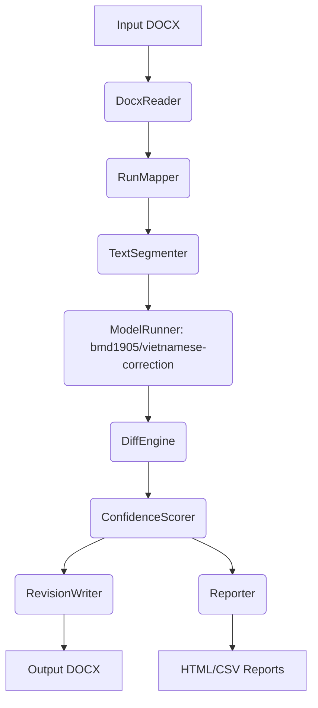

# VietDocProof

VietDocProof is a production-ready Python tool that automatically corrects Vietnamese spelling, grammar, and diacritics in `.docx` files using the `bmd1905/vietnamese-correction` model, while strictly preserving the original document formatting.

## Features
- **Format Preservation**: Edits are mapped back to individual runs to maintain bold, italic, color, and font settings.
- **Model Inference**: Uses HuggingFace `transformers` to process text chunks.
- **Diff & Confidence Engine**: Analyzes the token/character differences to classify edits as safe or aggressive.
- **Reporting**: Generates CSV, JSON, and HTML reports showing text diffs, confidence scores, and skipped edits.
- **Red Highlight Fallback**: Edits are highlighted in red text to simulate tracked changes without destroying formatting.

## Architecture



## Installation

```bash
python3 -m venv venv
source venv/bin/activate
pip install -r requirements.txt
```

## Usage

```bash
python cli.py \
    --input ./samples/input/sample.docx \
    --output ./samples/output/sample_corrected.docx \
    --report ./samples/report \
    --mode safe
```

## Limitations
- Word "Track Changes" (via `<w:ins>` / `<w:del>`) is currently not natively written into the OOXML. Instead, the red text fallback highlights changes. Full OOXML track changes is planned for Phase 2.
- Approximate Page heuristic is not exact as `python-docx` lacks a layout engine.
