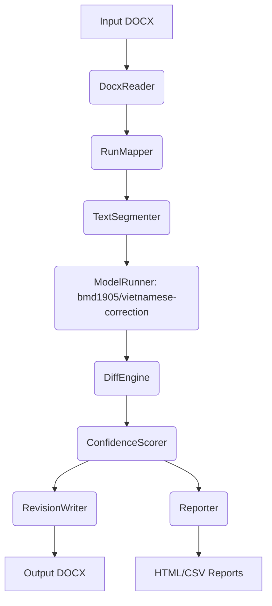

# VietDocProof 🪄

[](https://colab.research.google.com/github/vonguyendang/VietDocProof/blob/main/VietDocProof_Colab.ipynb)

VietDocProof is a production-ready Python tool that automatically corrects Vietnamese spelling, grammar, and diacritics in `.docx` files using the `bmd1905/vietnamese-correction` model, while **strictly preserving the original document formatting**.

## 🌟 Quick Start (Google Colab)

Don't want to install anything locally? Run VietDocProof directly in your browser with Google's free GPUs:

**👉 [Open in Google Colab](https://colab.research.google.com/github/vonguyendang/VietDocProof/blob/main/VietDocProof_Colab.ipynb)**

Our Colab version is extremely user-friendly. You can choose to run it natively via 1-click execution, or launch our professional Web Interface.

## ✨ Features
- **Format Preservation**: Edits are mapped back to individual runs to maintain bold, italic, color, and font settings.
- **Model Inference**: Uses HuggingFace `transformers` to process text chunks efficiently.
- **Web UI (Gradio)**: A professional, dark-themed terminal Web UI for non-technical users.
- **Diff & Confidence Engine**: Analyzes the token/character differences to classify edits as safe or aggressive.
- **Reporting**: Generates CSV, JSON, and HTML reports showing text diffs, confidence scores, and skipped edits.
- **Red Highlight Fallback**: Edits are highlighted in red text to simulate tracked changes without destroying formatting.

## 🛠 Local Installation

```bash
python3 -m venv venv
source venv/bin/activate
pip install -r requirements.txt
```

## 🚀 Usage

### 1. Web UI Wizard (Recommended)
Launch the beautiful Gradio Web UI locally:
```bash
python wizard.py
```
This will open a browser window at `http://127.0.0.1:7860/` where you can drag & drop your Word files.

### 2. Command Line Interface (CLI)
For batch processing or automation:
```bash
python cli.py \
    --input ./samples/input/sample.docx \
    --output ./samples/output/sample_corrected.docx \
    --report ./samples/report \
    --mode safe
```

## 🏗 Architecture



## ⚠️ Limitations
- Word "Track Changes" (via `<w:ins>` / `<w:del>`) is currently not natively written into the OOXML. Instead, the red text fallback highlights changes. Full OOXML track changes is planned for Phase 2.
- Approximate Page heuristic is not exact as `python-docx` lacks a layout engine.
